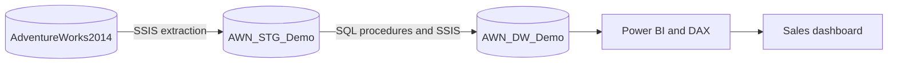
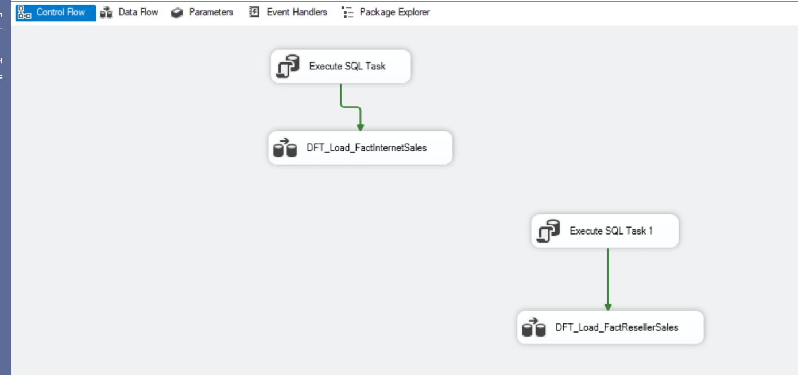
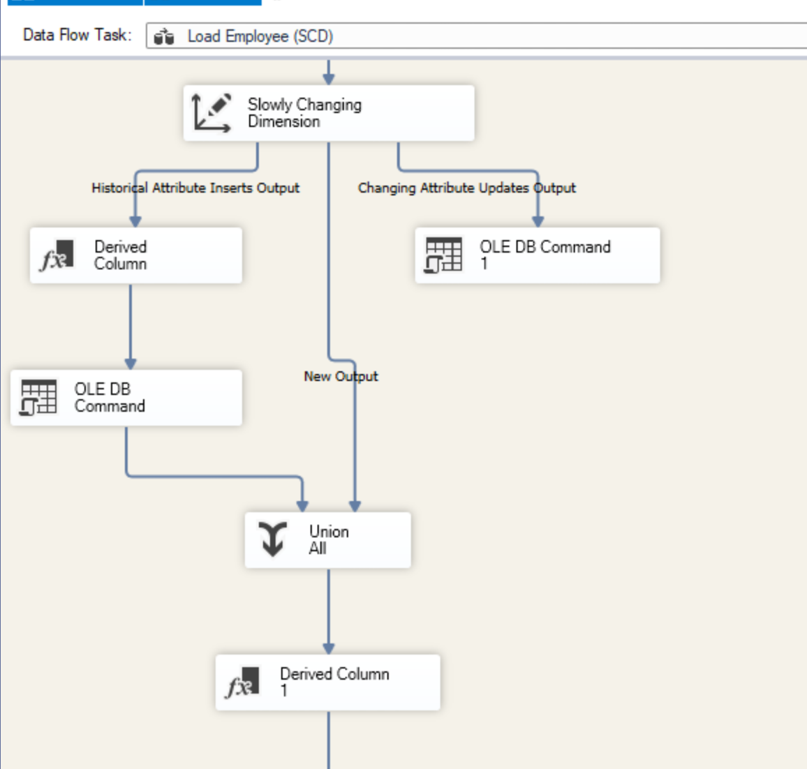

# AdventureWorks Sales Data Warehouse

**SQL Server · SSIS · Power BI · DAX · T-SQL**

I completed this project independently for the *Data Warehousing* course at Dalarna University in January 2026. The aim was to take data from an operational database, prepare it for analysis, and build a Power BI report for exploring sales performance.

The source is **AdventureWorks2014**, Microsoft's sample database for a fictional bicycle manufacturer. The course provided the assignment architecture and starter SQL scripts for the staging and warehouse databases. My work focused on implementing the SSIS data flows, loading and validating the warehouse data, handling changes to employee records, and developing the Power BI report.


## Architecture

The project follows a three-stage data pipeline, with Power BI used for the analytical model and reporting.



The staging database holds data extracted from AdventureWorks2014. The warehouse organizes this data into fact and dimension tables for sales analysis. Power BI connects to the warehouse and provides the measures, filters, and visualizations.

### Dimensional model

The Sales data mart is based on a **galaxy (fact constellation) schema** with two fact tables:

- `FactInternetSales` — online sales transactions.
- `FactResellerSales` — sales through resellers.

Both fact tables use `DimDate`, `DimProduct`, `DimSalesTerritory`, and `DimCurrency`. Internet sales also use `DimCustomer`, while reseller sales use `DimReseller` and `DimEmployee`.

The initial dimensional schema and dimension-loading stored procedures came from the course materials. I used these as the basis for the SSIS implementation and subsequent reporting.

## ETL implementation

I developed three SSIS packages in Visual Studio:

| Package | Purpose |
| --- | --- |
| [`Package.dtsx`](ssis/AdventureWorks-ETL/Package.dtsx) | Extracts source tables from AdventureWorks2014 and loads the staging database. |
| [`Employee.dtsx`](ssis/AdventureWorks-ETL/Employee.dtsx) | Loads `DimEmployee` using a Slowly Changing Dimension (SCD) transformation to distinguish historical changes from overwritten attributes. |
| [`Fact_tables.dtsx`](ssis/AdventureWorks-ETL/Fact_tables.dtsx) | Loads Internet and Reseller sales facts, using lookups to resolve dimension keys. |

The ETL work involved configuring OLE DB sources and destinations, mapping columns, resolving dimension keys, and checking the loaded records in SQL Server Management Studio. Some load steps clear target tables before reloading them; these packages were built for a course environment, not for incremental production processing.

Database connections are configured through three project parameters rather than fixed to a particular computer:

- `SourceConnectionString` — `AdventureWorks2014`
- `StagingConnectionString` — `AWN_STG_Demo`
- `WarehouseConnectionString` — `AWN_DW_Demo`

The default settings use Windows Authentication and a local `.\SQLEXPRESS` instance. Update the parameters in `Project.params` if your SQL Server instance has a different name.

### SSIS workflows

**Sales fact-table loading**



**Employee Slowly Changing Dimension**



## Power BI report

The report explores sales performance across several dimensions:

- **Time:** sales trends by month and year, with filters for 2012–2014.
- **Products:** sales by product category and subcategory.
- **Sales channels:** online versus reseller sales.
- **Geography:** regional and country-level comparisons.
- **Measures:** total sales and average sales per quarter, month, week, and day, calculated using DAX.

The dashboard includes column and bar charts, a monthly line chart, a regional donut chart, and a geographic map. Its filters allow the same measures to be compared across different segments of the data.

The Power BI file is available at [`powerbi/DW_lab2.2.pbix`](powerbi/DW_lab2.2.pbix). When opening or refreshing the report on another computer, its SQL Server data-source settings may need to be updated.

## Repository structure

```text
adventureworks-data-warehouse/
├── README.md
├── .gitignore
├── ssis/
│   ├── AdventureWorks-ETL.sln
│   └── AdventureWorks-ETL/
│       ├── AdventureWorks-ETL.dtproj
│       ├── AdventureWorks-ETL.database
│       ├── Project.params
│       ├── Package.dtsx
│       ├── Employee.dtsx
│       └── Fact_tables.dtsx
├── sql/
│   ├── SQL_scriptd_lab2.2.sql
│   └── README.md
├── powerbi/
│   └── DW_lab2.2.pbix
└── docs/
    ├── dashboard.jpg
    ├── ssis-fact-loading.png
    ├── ssis-employee-scd.png
    └── PUBLISHING_CHECKLIST.md
```

The SQL file contains validation queries and a datatype adjustment for `DimEmployee`. It is not a complete set of database creation scripts.

## Running the project locally

**Requirements:** SQL Server and SSMS, Visual Studio with the SSIS Projects extension, and Power BI Desktop. The SSIS project targets SQL Server 2022 and requires a compatible SSIS runtime and OLE DB provider.

1. Download and restore the **AdventureWorks2014 OLTP** sample database using [Microsoft's instructions](https://learn.microsoft.com/en-us/sql/samples/adventureworks-install-configure). This is the transactional database, not the prebuilt AdventureWorks data warehouse.
2. Create the staging and warehouse databases using the course-provided `1_AWN_STG_Demo.sql` and `2_AWN_DW_Demo.sql` scripts. These scripts are not included in this repository.
3. Open [`ssis/AdventureWorks-ETL.sln`](ssis/AdventureWorks-ETL.sln) in Visual Studio and configure the three connection-string parameters for your SQL Server instance.
4. Run the source-to-staging package, execute the provided procedures to populate the non-employee dimensions, then run the employee SCD and sales fact-table packages. **Use test databases:** some tasks truncate tables before loading them.
5. Open the Power BI report, point its data source to the populated warehouse, and refresh the model.

Because the course-provided SQL scripts are not redistributed, the repository documents the implementation but is not fully reproducible from the included files alone.

## Scope and limitations

- The assignment included an SSAS Tabular stage. I could not complete its deployment because of a local installation issue, so I created the analytical relationships and DAX measures directly in Power BI instead.
- The employee SSIS flow has a design-time warning: the `EmailAddress` source field allows 256 characters, while the destination is limited to 50. The maximum email length in the dataset I checked was 28 characters; longer records would require a schema change or additional validation.
- Scheduled refreshes and automated deployment were not part of the completed implementation.

## Acknowledgements

**AdventureWorks2014** is a sample database published by Microsoft. The project was completed independently as coursework at **Dalarna University**, which provided the lab brief, target architecture, and initial SQL schema and procedure scripts. The SSIS packages, data-loading configuration and troubleshooting, SQL checks, and Power BI report were completed as part of my implementation.

The Microsoft database backup and university-provided starter scripts are not redistributed in this repository.
